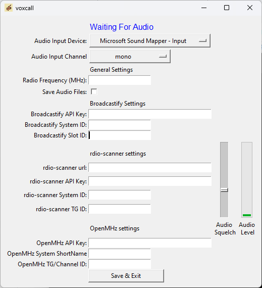

# voxcall
A sound-activated audio recorder with support for uploading audio to [Broadcastify Calls](https://www.broadcastify.com/calls/) and to [rdio-scanner](https://github.com/chuot/rdio-scanner).  For Windows and Raspberry Pi.

## Operation
- Connect a single-channel radio receiver to the sound card input on the computer.  If audio will be uploaded to Broadcastify Calls, the receiver should not be scanning multiple frequencies.
- Set the Audio Squelch using the slider.  Audio above the level of the slider will trigger recording.  The current audio level is shown adjacent to the slider.  Set the level of the slider while testing with the radio squelched and unsquelched.  
- To upload recorded audio files to Broadcastify Calls, enter information received from Broadcastify support
  - API key goes in the API key field
  - SID goes in the System ID field
  - Slot goes in the Slod ID filed (default to 1 if no Slot ID is provided)
- To upload recorded audio files to rdio-scanner, enter information for the desired rdio-scanner instance
  - URL of the rdio-scanner api (for example:  192.168.1.138:3000/api/call-upload )
  - rdio-scanner API key (create using the rdio-scanner admin interface)
  - System ID
  - Talkgroup ID
- To upload recorded audio files to OpenMHz, enter information for the desired OpenMHz system
  - OpenMHz API key
  - ShortName of the System
  - Talkgroup ID (for conventional systems, simply choose any integer number for this field)
  - A Radio Frequency must be entered in the General Settings area
- When audio is detected above the Audio Squelch level, audio will be recorded until two seconds of silence is detected.  Once the recording ends, an MP3 file will be created.  
  - If valid Broadcastify Calls credentials are entered, the MP3 file will be uploaded to that system.  
  - If valid rdio-scanner credentials are entered, the MP3 file will be uploaded to that system.
  - If valid OpenMHz credentials are entered, the MP3 file will be uploaded to that system.
  - If the "Save Audio Files" option is selected, the recordings will be saved to the /audiosave subdirectory.   Otherwise, the MP3 will be deleted.  The filename will be the UNIX timestamp of when the recording was started. 
- There is a two-minute timeout timer.  If a recording exceeds two minutes (stuck squelch, noise, etc.) recording will stop, an error will be displayed, and no further activity will take place until the input audio goes below the Audio Squelch threshold, at which time normal operation will resume.
- Multiple instances can be run at the same time to capture audio from multiple recievers.  Create a different directory for each instance.  Each directory must have a config.cfg file.  On Windows, each directory should also have a copy of ffmpeg.exe or ffmpeg.exe must be added to the system path.  
- Something not working?  Check the log.txt file for errors and create an Issue here if needed.

## Windows EXE
[ZIP Download](https://github.com/aaknitt/voxcall/releases/download/1.1.0/voxcall.zip.-.Windows.EXE.zip)
- Uncompress the downloaded ZIP file
- Run the EXE

## Raspberry Pi executable binary (compiled for Raspbian Buster)
[TGZ Download](https://github.com/aaknitt/voxcall/releases/download/1.1.0/voxcall.tgz.-.Raspberry.Pi.32.bit.OS.tgz)
- Use a cheap USB sound card as the audio input - the Pi does not come with an audio input
- Download using link above or via `curl -O https://radioetcetera.site/radioetcetera/files/voxcall.tgz`
- `tar zxf voxcall.tgz` to uncompress
- Install pulseaudio:
  - `sudo apt-get install pulseaudio`
- If ffmpeg isn't already installed, install it:
  - `sudo apt-get install ffmpeg`
- To run:
  - `/home/pi/voxcall/voxcall`

